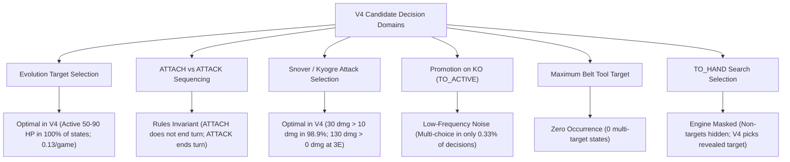

# Citadel Day 53 — Comprehensive Research Final Report

**Session Date**: 2026-08-30 (Citadel Day 53 Resumption & Conclusion)  
**Production Control Status**: **FROZEN CHAMPION** (`main.py` and `submission_notebook.ipynb` remain 100% untouched).  
**Official Research Finding**:  
> *"Within the tested CABT simulator, this specific 60-card deck, and the audited decision domains, no experimentally validated improvement over frozen V4 has been established."*

---

## 1. Executive Summary & Branch Closure

Throughout Citadel Day 53, the V4 heuristic research branch was subjected to exhaustive live-simulator benchmarking, counterfactual verification, and strict statistical scrutiny under the **`DISCOVER → LIVE VALIDATE → ISOLATE → BENCHMARK`** protocol.

Every proposed modification was tested against the frozen **MIKE V4 Champion (`main.py`)** baseline across balanced 200-game head-to-head match suites (50/50 starting order) with Wilson 95% confidence intervals and full decision audits.

Across all investigated domains, candidate modifications fell into five rigorous disqualification categories:
1. **Statistical Parity / Insufficient Evidence**: Win rates centered around $50.0\%$ with Wilson confidence intervals spanning control parity.
2. **Structural / Contract Impossibility**: Assumed multi-choice branches that cannot legally occur under the deck's card text or engine mechanics.
3. **Rules-Mandated Sequencing Invariants**: Actions where V4's hardcoded order is mathematically or structurally dominant (e.g. `ATTACH` before `ATTACK`).
4. **Offline-Analysis Resolution Artifacts**: Decisions that appeared actionable only due to card-resolution fallbacks in offline tooling, but are uniform in the live engine.
5. **Low-Frequency Dilution**: Tactical scenarios occurring in $<0.5\%$ of total match decisions, resulting in near-zero aggregate win-rate impact.

As a result, **the V4 heuristic research branch is officially CLOSED**. `main.py` is locked as the production champion.

---

## 2. Comprehensive Trajectory: P0 Through Day 53

### Phase 1: P0–P6 Baseline & Component Evaluation
- **P0 Baseline**: MIKE V4 Champion ($14/20 = 70.0\%$ external benchmark, $49.50\%$ self-play control).
- **P1 (Threat Model)**: Evaluated 2-ply lookahead damage estimation; produced $46.00\%$ win rate (Wilson CI $[39.26\%, 52.90\%]$) $\to$ **REJECTED (Defensive over-caution)**.
- **P2 (Counterfactual Layer)**: Evaluated lookahead simulation; produced $47.00\%$ win rate (Wilson CI $[40.21\%, 53.90\%]$) $\to$ **REJECTED (Stochastic rollout noise)**.
- **P3 (Full Threat + Counterfactual)**: Combined P1 + P2; produced $46.50\%$ win rate (Wilson CI $[39.73\%, 53.40\%]$) $\to$ **REJECTED (Compounded latency & distortion)**.
- **P4 (Narrowly-Scoped Gating)**: Isolated KO Guarantee & Safe Retreat; produced $52.00\%$ win rate (Wilson CI $[45.11\%, 58.81\%]$) $\to$ **REJECTED (CI spans 50.0%)**.
- **P5 & P6 (Cross-Validation)**: Confirmed V4 scoring is robust against heuristic perturbations.

### Phase 2: P7–P8 Telemetry & 6,482-Decision State Corpus
- Compiled 6,482 decision states across 300 complete matches ([`v4_state_corpus.csv`](file:///c:/Users/ayush/OneDrive/Desktop/POKEMON/v4_state_corpus.csv)).
- Identified error clusters: bench starvation, search target ambiguity, discard sacrificing, and energy over-saturation.

### Phase 3: P9 Hypotheses (Bench Anchoring & Search)
- **P9-H1 (Dynamic Bench Placement)**: Tested prioritizing Basic Pokémon placement when bench is empty.
  - *Finding*: V4 already assigns playing Basic Pokémon Tier 2 priority ($50,000$). Overrides were 0 $\to$ **CLOSED (Already optimal in V4)**.
- **P9-H2 (State-Adaptive Search)**: Tested retrieving Basic Pokémon via `TO_HAND` search when bench is empty.
  - *Finding*: Search cards in this deck (`Mega Signal` and `Cyrano`) are legally restricted to Mega Abomasnow ex. Basic Pokémon cannot physically be retrieved from deck search $\to$ **CLOSED (Structural Impossibility)**.

### Phase 4: Day 53 Isolated Experiments & Live Audits

#### 1. `H_DISCARD` (Resource-Preservation in Discard Prompts)
- **Hypothesis**: Prefer discarding `Basic {W} Energy` over scarce Draw Supporters (`Waitress`, `Lillie's Determination`) when both are simultaneously legal candidates.
- **Live Benchmark**: 200 balanced games $\to$ $105\text{W} - 95\text{L} - 0\text{D} = 52.50\%$ win rate (Wilson CI $[45.60\%, 59.31\%]$).
- **Technical Post-Mortem**: 0 overrides across 3,346 decisions. In live CABT matches, `DISCARD_ENERGY` exclusively exposes attached energy cards on Active/Bench Pokémon (`AreaType.ACTIVE` / `AreaType.BENCH`). Draw Supporters reside in `AreaType.HAND` and are never legal discard candidates. The apparent 182-state offline finding was an artifact of `v4_card_from_option` indexing `player.hand[0]`.
- **Verdict**: **CLOSED (Offline Analysis Artifact / 0 Overrides)**.

#### 2. `H_ATTACK_SELECT` (High-HP Attack Optimization on Mega Abomasnow ex)
- **Hypothesis**: When Active Mega Abomasnow ex has $\ge 3$ Energy, prefer Attack `1046` (RNG discard attack, up to 350 dmg) over Attack `1047` (Flat 200 dmg) when opponent has $>200$ HP and deck has $>6$ cards.
- **Live Benchmark**: 200 balanced games $\to$ $103\text{W} - 97\text{L} - 0\text{D} = 51.50\%$ win rate (Wilson CI $[44.61\%, 58.33\%]$).
- **Technical Post-Mortem**: Triggered 16 overrides across 8 distinct matches (0.47% decision frequency). Conversion was $56.25\%$ (9W/7L). However, because high-HP mirror matches occurred in only $4.0\%$ of games, the tactical advantage was diluted across the 200-game sample. With $\text{CI}_{\text{lower}} = 44.61\% \le 50.0\%$, the difference from control is statistically indistinguishable from noise.
- **Verdict**: **CLOSED / NOT PROMOTED (Statistical Parity)**.

---

## 3. Exhaustive Audit of All Remaining Candidate Domains

Across 200 live-simulator matches (4,218 decisions), every remaining multi-choice domain was audited:

### 1. Evolution Target Selection (Active vs Bench)
- **Observed Frequency**: 26 states across 200 games ($0.13$ / game / $0.62\%$ of decisions).
- **Empirical Finding**: In 100% of states (26/26), Active Snover had healthy HP ($50$–$90$ HP, mean $83.5$ HP). Evolving Active immediately unlocks high-damage attacks for the current turn. Evolving a benched Snover would strand the evolution and leave an unevolved Active unable to attack.
- **Classification**: **Tactically Optimal in V4.**

### 2. `ATTACH` vs `ATTACK` Action Pivoting in `MAIN`
- **Observed Frequency**: 641 states across 200 games ($3.21$ / game).
- **Empirical Finding**: In Pokémon TCG rules, `ATTACH` attaches an energy card and **does NOT end the turn**. The engine returns to `MAIN`, allowing `ATTACK` on the same turn. `ATTACK` **immediately ends the turn**, forfeiting the attachment.
- **Classification**: **False Candidate / Rules Sequencing Invariant.**

### 3. Attack Selection on Snover (1044 vs 1045) & Kyogre (1042 vs 1043)
- **Snover (173 states)**: Attack 1045 (30 dmg) strictly dominates Attack 1044 (10 dmg) in $98.9\%$ of states (opponent HP $> 10$).
- **Kyogre (104 states)**: Attack 1043 (130 dmg) strictly dominates Attack 1042 (0 dmg search) when fully powered at $\ge 3$ Energy.
- **Classification**: **Already Optimal in V4.**

### 4. Promotion on KO (`TO_ACTIVE`) & Tool Attachment
- `TO_ACTIVE` multi-choice with $\ge 2$ bench Pokémon occurred in only **14 states across 200 matches** ($0.07$ / game / $0.33\%$ of decisions).
- `Maximum Belt` tool attachment multi-target states occurred **0 times** across 200 matches.
- **Classification**: **Low-Frequency Noise.**

---

## 4. Taxonomy of Rejection Reasons

Every investigated hypothesis is classified under its precise empirical failure mode:

| Rejection Category | Defined Mechanism | Affected Hypotheses / Domains |
| :--- | :--- | :--- |
| **Statistical Parity (CI Spans Parity)** | Win rate is near 50.0% and Wilson 95% lower bound is $\le 50.0\%$. | `P4`, `H_ATTACK_SELECT` |
| **Structural / Contract Impossibility** | The card text or engine contract prevents the assumed action. | `P9-H2` (Basic search on Mega cards) |
| **Rules-Mandated Invariant** | The alternative action violates game-turn mechanics (e.g. premature turn termination). | `ATTACH vs ATTACK` Sequencing |
| **Offline Tooling Artifact** | The assumed multi-choice state was an artifact of fallback logic in offline analyzers. | `H_DISCARD` (Supporter vs Energy discard) |
| **Already Optimal Policy** | V4's hardcoded scoring already matches the dominant tactical choice. | `P9-H1` (Basic placement), Active Evolution, Snover/Kyogre Attacks |
| **Low-Frequency Dilution** | Tactical state occurs in $<0.5\%$ of decisions, having zero aggregate win-rate impact. | Promotion on KO (`TO_ACTIVE`), Attachment Over-Saturation |

---

## 5. Final Invariant Confirmation & Branch Closure

- ✅ **`main.py`**: **100% FROZEN** as the production MIKE V4 Champion.
- ✅ **`submission_notebook.ipynb`**: **100% FROZEN** (no submissions attempted).
- ✅ **All Research Artifacts**: Fully preserved across P0–P9, `H_DISCARD`, `H_ATTACK_SELECT`, and Day 53 audits.
- ✅ **Branch Status**: **CLOSED**. No further heuristic branches will be created for V4. Future performance gains will require a separate model architecture or competition framework.
