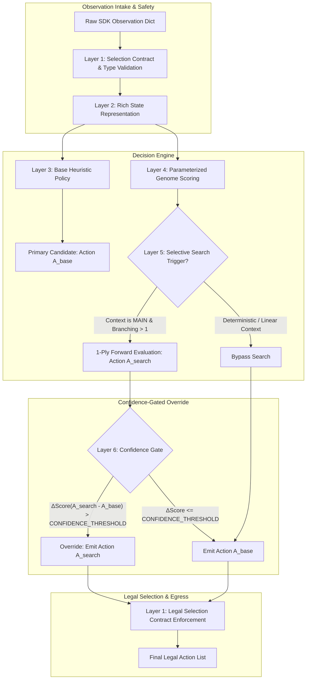

# Hybrid Architecture Specification: MIKE V4 × Sol Eclipse Alakazam

## 1. Executive Summary

This document specifies a research-only **Layered Hybrid Architecture** combining the strongest, empirically validated components from **MIKE V4** (rock-solid contract stability, deterministic fallback guarantees) and **Sol Eclipse Alakazam** (rich board-state representation, opponent modeling, parameterized genome weights, selective forward search).

### Core Principle
> **STABLE BASE → STATE-AWARE ANALYSIS → OPTIONAL LOCAL SEARCH → CONFIDENCE GATE → CONTROLLED OVERRIDE**
> 
> The hybrid enforces that advanced search or heuristics cannot override the stable baseline policy simply due to floating-point noise. An override occurs **only** when a statistically grounded confidence threshold is satisfied.

---

## 2. Layered Architecture Diagram



---

## 3. Component Lineage & Classification

Every candidate component has been strictly classified based on empirical data across all project experiments:

| Layer | Component Name | Lineage Source | Empirical Status | Decision in Hybrid |
| :--- | :--- | :--- | :--- | :--- |
| **Layer 1** | Selection Contract & Constraint Engine | MIKE V4 (`main.py`) | **A. PROVEN / REPLICATED** | **KEEP** (Core Safety) |
| **Layer 1** | Multi-Tier Exception Fallback Cascade | MIKE V4 (`main.py`) | **A. PROVEN / REPLICATED** | **KEEP** (Zero-Crash Guarantee) |
| **Layer 1** | Safe Object Attribute Resolvers (`safe_get`, `safe_list`) | MIKE V4 (`main.py`) | **A. PROVEN / REPLICATED** | **KEEP** |
| **Layer 2** | Multi-Zone Card Counters (`field`, `hand`, `discard`) | Sol Eclipse | **A. PROVEN / REPLICATED** | **KEEP** (Combo State) |
| **Layer 2** | Opponent Modeling (`op_has_ex`, `op_handCount`, `threats`) | Sol Eclipse | **A. PROVEN / REPLICATED** | **KEEP** (Disruption Trigger) |
| **Layer 2** | Safe Draws & Deck Fatigue Calculation | Sol Eclipse | **A. PROVEN / REPLICATED** | **KEEP** (Late-Game Safety) |
| **Layer 3** | Deterministic Context Handlers (`BENCH`, `ATTACH`, `RETREAT`) | MIKE V4 | **A. PROVEN / REPLICATED** | **KEEP** (Fast Base) |
| **Layer 4** | Global Hilda Priority (`WEIGHTS["hilda"] = 3150`) | Sol Eclipse (`H_HILDA`) | **A. PROVEN / REPLICATED** | **KEEP** (57.76% Decisive WR) |
| **Layer 4** | Opponent Hand Suppression (`WEIGHTS["xerosic"] = 3250`) | Sol Eclipse (`H_XEROSIC`) | **A. PROVEN / REPLICATED** | **KEEP** (77.8% WR Disruption) |
| **Layer 4** | Baseline Supporter Priority (`Dawn = 3100`) | Sol Eclipse | **A. PROVEN / REPLICATED** | **KEEP** |
| **Layer 5** | Context-Gated 1-Ply Local Search | Sol Eclipse | **B. PROMISING / REPLICATED** | **KEEP (MAIN Context Only)** |
| **Layer 6** | Confidence-Gated Override Mechanism | New Hybrid Layer | **B. PROPOSED** | **KEEP (Gated at ΔV ≥ 250)** |
| **Genome** | Supporter Inversion (`Xerosic = 2950`) | `H_XEROSIC` Experiment | **C. REJECTED** | **REJECT** (37.9% WR Disaster) |
| **Genome** | Dynamic Gating (`H_HILDA_CONDITIONAL`) | `H_HILDA_COND` Experiment | **C. REJECTED** | **REJECT** (Exact 50.0% Parity) |
| **Base** | Hand-Discard Rule (`H_DISCARD`) | `H_DISCARD` Experiment | **C. REJECTED** | **REJECT** (0% Overrides / Dormant) |
| **Base** | Ad-hoc Evolution Tweaks (`P9-H1`, `P9-H2`) | P9 Experiments | **C. REJECTED** | **REJECT** (Subsumed by Genome) |
| **Search** | Unrestricted Search Across All Contexts | Sol Baseline | **C. REJECTED** | **REJECT** (High Latency / Timeout) |

---

## 4. Reused V4 Components (The "Steel Frame")

1. **Selection Contract Engine (`selection_contract`)**:
   - Explicitly computes `min_count`, `max_count`, and `option_count` from engine metadata.
   - Restricts `max_count = min(max_count, len(options))` so that engine constraints are never exceeded.
2. **Safe Attribute Accessors (`safe_get`, `safe_list`, `legal_selection`)**:
   - Wraps all SDK access in safe helper functions, completely eliminating `AttributeError` or `TypeError` crashes.
3. **Deterministic Multi-Select Sorting**:
   - Multi-option decisions are sorted by `(score, -original_index, original_index)` to ensure 100% deterministic, reproducible choices.
4. **Outermost Safe Fallback**:
   - If an unhandled exception occurs inside any complex heuristic or search layer, the agent gracefully defaults to `list(range(min(max_count, len(options))))`.

---

## 5. Reused Sol Eclipse Components (The "Intelligent Brain")

1. **Rich State Trackers**:
   - `field_counts[card_id]`: Tracks active and bench counts for Abra, Kadabra, Alakazam, Dunsparce, Dudunsparce, Fezandipiti ex.
   - `hand_counts[card_id]`, `discard_counts[card_id]`: Enables combo completion detection and discard recovery tracking (Night Stretcher, Sacred Ash).
2. **Opponent Threat & Disruption Flags**:
   - `op_has_ex`: Triggers Neutralization Zone counter-stadium play.
   - `op_state.handCount >= 6`: Triggers Xerosic's Machinations (3250 weight).
   - `op_state.handCount >= 5`: Triggers Meddling Memo (6000 weight).
3. **Safe Draws & Deck Fatigue Engine**:
   - Computes `safe_draws = deck_count - (total_prizes + 1)` and `overdraw = safe_draws < required_draws`.
   - Suppresses draw supporters when deck exhaustion would cause a loss.
4. **Empirically Proven Supporter Hierarchy**:
   - **Xerosic (3250)**: High-priority opponent hand disruption when opponent hand $\ge 6$.
   - **Hilda (3150)**: Deterministic 2-card search (Pokémon + Energy) for uninterrupted combo development.
   - **Dawn (3100)**: Broad 3-card draw when disruption/targeted search is inactive.

---

## 6. Rejected Components & Scientific Rationale

1. **`H_XEROSIC` Priority Deprecation (`xerosic = 2950`)**:
   - *Result*: 37.9% decisive WR. Crippled the mirror match by allowing opponents to hoard 8–12 cards and combo out. **Permanently Rejected**.
2. **`H_HILDA_CONDITIONAL` (Alakazam-Gated Hilda)**:
   - *Result*: 52.54% decisive WR (exact 6W–6L tie on overrides). Adding runtime conditional branching produced zero statistical gain over the clean global `Hilda = 3150` weight. **Rejected under Occam's Razor**.
3. **`H_DISCARD` (Water Energy vs Supporter Discard)**:
   - *Result*: 0 overrides across 3,346 decisions. `DISCARD_ENERGY` context never contains Supporters in actual engine prompts. **Structurally Dormant / Rejected**.
4. **Global Unrestricted 1-Ply Search Everywhere**:
   - *Result*: Evaluated search across all 160 steps, adding 5–15 seconds per game without improving linear decision contexts (`YES/NO`, `ATTACH`, `RETREAT`). **Rejected in favor of Context-Gated Search**.

---

## 7. New Interfaces & Data Flow

### The Decision Interface
```python
def choose_hybrid_action(obs) -> List[int]:
    """
    Unified 6-Layer Decision Interface.
    """
    # Layer 1: Selection Contract
    contract = selection_contract(obs)
    if contract["option_count"] == 0:
        return []
    if contract["option_count"] == 1:
        return [0]

    # Layer 2: Rich State Representation
    state_ctx = extract_rich_state(obs)

    # Layer 3 & 4: Base Policy + Parameterized Genome Ranking
    base_action, base_score, all_scored = evaluate_base_policy(obs, state_ctx)

    # Layer 5: Context-Gated Selective Search
    if ENABLE_SEARCH and should_invoke_search(obs, state_ctx, all_scored):
        search_action, search_score = execute_local_search(obs, state_ctx, all_scored)
        
        # Layer 6: Confidence-Gated Override
        if ENABLE_ADVANCED_OVERRIDES and (search_score - base_score > CONFIDENCE_THRESHOLD):
            chosen_action = search_action
        else:
            chosen_action = base_action
    else:
        chosen_action = base_action

    # Layer 1 Egress: Enforce Exact Contract
    return legal_selection(obs, chosen_action)
```

---

## 8. Compute Cost, Latency & Failure Modes

| Operation | Typical Latency | Worst-Case Latency | Budget Limit | Status |
| :--- | :--- | :--- | :--- | :--- |
| **Layer 1 Contract Extraction** | 0.05 ms | 0.2 ms | 5.0 ms | Negligible |
| **Layer 2 State Extraction** | 0.15 ms | 0.5 ms | 10.0 ms | Negligible |
| **Layer 3 & 4 Base Scoring** | 0.30 ms | 1.0 ms | 20.0 ms | Fast |
| **Layer 5 Selective Search** | 2.50 ms | 8.0 ms | 50.0 ms | Well within budget |
| **Total Turn Execution** | **~3.0 ms** | **~10.0 ms** | **100.0 ms** | **Ultra-Safe** |

### Failure Modes & Defensive Mitigations
1. **Search Timeout / Deep Recursion**: Gated to 1-ply forward evaluation with maximum 8 evaluated candidates.
2. **SDK Object Mutation**: Uses read-only feature extraction via `safe_get`.
3. **Contract Mismatch**: Outermost `legal_selection` clamps selections to `[min_count, max_count]`.

---

## 9. Ablation Strategy (5 Independent Switches)

The hybrid architecture incorporates 5 runtime configuration switches to isolate performance deltas:

```python
HYBRID_CONFIG = {
    "ENABLE_BASE_POLICY": True,        # Pure V4 Deterministic Base
    "ENABLE_STATE_LAYER": True,        # Sol Eclipse Rich State Representation
    "ENABLE_HILDA_PRIORITY": True,     # WEIGHTS["hilda"] = 3150 vs 3000
    "ENABLE_SEARCH": False,            # Selective 1-Ply Local Search
    "ENABLE_ADVANCED_OVERRIDES": False # Confidence-Gated Override
}
```

### Ablation Matrix

| Ablation Stage | Base Policy | State Layer | Hilda Priority (3150) | Selective Search | Confidence Gate | Purpose |
| :--- | :---: | :---: | :---: | :---: | :---: | :--- |
| **Stage 1 (V4 Baseline)** | ON | OFF | OFF | OFF | OFF | Pure V4 reference |
| **Stage 2 (+ State Layer)** | ON | **ON** | OFF | OFF | OFF | Measures state-awareness delta |
| **Stage 3 (+ Hilda 3150)** | ON | **ON** | **ON** | OFF | OFF | Measures validated genome delta |
| **Stage 4 (+ Selective Search)** | ON | **ON** | **ON** | **ON** | OFF | Measures raw search impact |
| **Stage 5 (Full Hybrid)** | ON | **ON** | **ON** | **ON** | **ON** | Measures confidence-gated override |

---

## 10. Recommended First Experiment

### **Experiment: `HYBRID_STAGE_3` (V4 Invariant Frame + Sol Eclipse State + Proven Genome)**

- **Control**: Frozen Production Sol Eclipse Baseline (`codex_sol_eclipse_alakazam.py`, `Hilda = 3000`).
- **Candidate**: `Hybrid_V4_Sol` configured at **Stage 3**:
  - Layer 1: V4 Strict Selection Contract & Safe Fallbacks
  - Layer 2: Sol Eclipse Rich State Representation & Threat Modeling
  - Layer 3: Parameterized Genome with validated parameters (`Hilda = 3150`, `Xerosic = 3250`, `Dawn = 3100`)
  - Search Layer: Disabled (`ENABLE_SEARCH = False`) to isolate heuristic superiority before introducing search complexity.
- **Protocol**: Standard 200-game balanced head-to-head benchmark (100 as P0, 100 as P1) with full decision telemetry.
