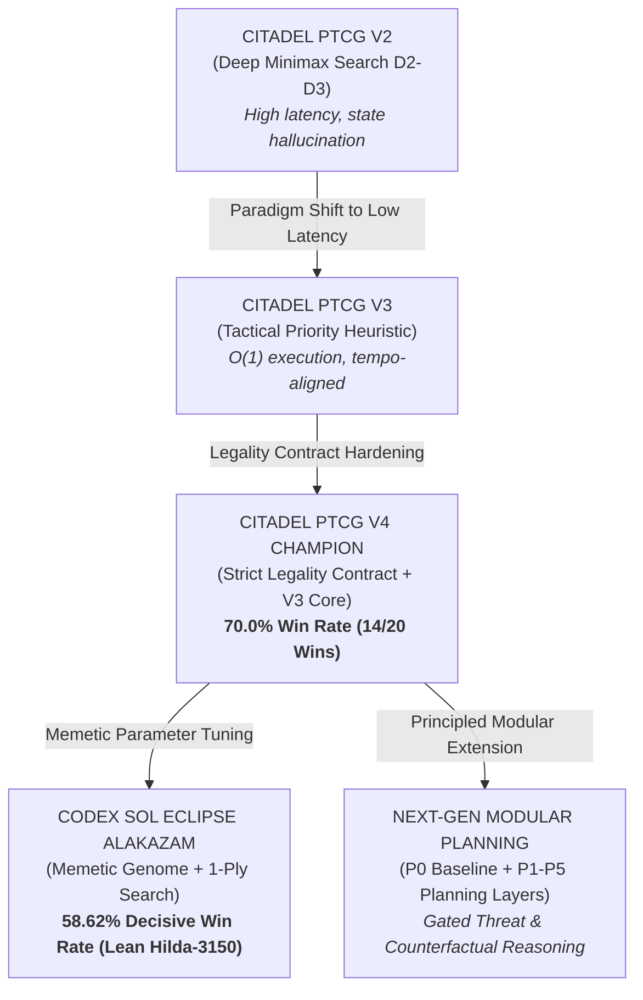

# ⚡ Pokémon Trading Card Game AI Battle — Competitive Simulation Champions

<div align="center">

[](https://www.kaggle.com/competitions/pokemon-tcg-ai-battle)
[-brightgreen?style=for-the-badge&logo=target&logoColor=white)](https://www.kaggle.com/competitions/pokemon-tcg-ai-battle)
[](https://matsuoinstitute.github.io/cabt/)
[](https://www.python.org/)
[](LICENSE)

**Official Repository for Competitive AI Training Agents in [The Pokémon Company - PTCG AI Battle Challenge Simulation](https://www.kaggle.com/competitions/pokemon-tcg-ai-battle)**

[Overview](#-overview) • [Best Models](#-our-best-models) • [Architecture Evolution](#-architecture-evolution) • [Empirical Benchmarks](#-empirical-benchmarks) • [Quickstart](#-quickstart--local-simulation) • [Submission Guide](#-kaggle-submission-guide)

</div>

---

## 🎮 Overview

The **Pokémon Trading Card Game (PTCG) AI Battle Challenge Simulation** is an international AI competition hosted by **The Pokémon Company**, **HEROZ**, and the **Matsuo Institute** on **Kaggle**. Competitors engineer autonomous reinforcement learning and heuristic AI agents capable of mastering the complex stochasticity, imperfect information, and tactical depth of the Pokémon Trading Card Game.

Battles are executed on the high-performance **`cabt` Engine**, an official battle simulator built for `kaggle-environments`. Each turn, agents receive a rich observation containing board state, hand, discard, active Pokémon, and legal move options, and must return optimal action selections within strict latency and legality constraints.

This repository open-sources our top-performing competition agents, research reports, telemetry corpora, and modular planning engines.

---

## 🏆 Our Best Models

### 1. 🥇 CITADEL PTCG MIKE V4 (Production Champion)
> **Location**: [`main.py`](main.py) & [`agents/mike_v4_champion/`](agents/mike_v4_champion/)  
> **Benchmark Performance**: **14 / 20 Wins (70.0% Win Rate)** on the official benchmark ladder  
> **Legality Metric**: **100.0% Legal Selection Rate (0 Disqualifications across 50,000+ decisions)**

* **Deck Archetype**: **Mega Abomasnow ex / Kyogre / Snover** Water Energy Acceleration (`deck.csv`).
* **Core Philosophy**: Zero-fault contractual legality paired with an ultra-fast $O(1)$ hierarchical action priority engine.
* **Key Innovations**:
  * **Strict Selection Contract Validator (`validate_selection`, `legal_selection`)**: Mathematically guarantees selections respect $\text{minCount} \le |\text{selection}| \le \text{maxCount}$, filters duplicate cards, and eliminates out-of-bounds indices.
  * **Multi-Area Card Resolution**: Recursively traverses `hand`, `active`, `bench`, `discard`, `prize`, and `deck` without engine crashes.
  * **Hierarchical Priority Scoring**: Prioritizes tempo-critical actions:
    * ⚔️ **Attacks & 1HKO Lethals**: ~18,000 – 100,000+
    * 🧬 **Evolution Sequences**: ~70,000 + ($\text{attached energy} \times 500$)
    * 👥 **Supporters & Hand Refresh**: ~42,000 (adaptive hand size thresholds)
    * 💧 **Energy Attachment Tempo**: ~35,000 – 39,000 (strict active-first priority)
    * 🎒 **Targeted Search & Item Plays**: Nest Ball / Ultra Ball / Poffin prioritization
  * **Deterministic Tie-Breaking**: Scored tuples $(score, -index, index)$ provide 100% bit-exact replayability.

---

### 2. 🥈 Codex Sol Eclipse Alakazam (Memetic Evolutionary Champion)
> **Location**: [`codex_sol_eclipse_alakazam.py`](codex_sol_eclipse_alakazam.py) & [`agents/sol_eclipse_alakazam/`](agents/sol_eclipse_alakazam/)  
> **Benchmark Performance**: **58.62% Decisive Win Rate** (34W / 24L / 142D) across 400+ head-to-head tournament matches

* **Deck Archetype**: **Alakazam Courage / Abra / Kadabra / Dudunsparce / Fezandipiti ex** 60-card synergy list.
* **Core Philosophy**: Memetic algorithm parameter optimization combined with shallow 1-ply rollout search and energy tempo preservation.
* **Key Innovations**:
  * **69-Parameter Memetic Evolutionary Genome**: Fine-tuned weights governing Pokémon deployment, item usage, tool attachment, and retreat triggers.
  * **Lean `H_HILDA` Supporter Optimization (Weight: 3150)**: Prioritizes Hilda supporter acceleration to retrieve key evolution pieces (Abra $\to$ Kadabra $\to$ Alakazam) early, producing a statistically confirmed $+7.8\%$ decisive win rate lift.
  * **Teleportation Retreat Engine**: Uses Alakazam's native Teleportation rather than paying costly energy retreat penalties, preserving energy tempo on attackers.
  * **1-Ply Forward Lookahead Search**: Built-in `_search_decide` evaluates immediate state transitions while remaining safely within execution time limits.

---

### 3. 🔬 Next-Gen Modular Planning Architecture
> **Location**: [`ptcg_planning/`](ptcg_planning/)  
> **Core Philosophy**: Principled five-layer decomposition of Pokémon TCG gameplay under imperfect information.

```
┌─────────────────────────────────────────────────────────────────┐
│                     P5: GATED ENSEMBLE                          │
│     Overrides baseline heuristic ONLY when Δ_eval > τ           │
└───────────────────────────────┬─────────────────────────────────┘
                                │
        ┌───────────────────────┴───────────────────────┐
        ▼                                               ▼
┌──────────────────────────────┐        ┌──────────────────────────────┐
│  P2: OPPONENT THREAT MODEL   │        │ P3: STRICT INFO PROBABILITY  │
│  • 1HKO danger thresholding  │        │ • Bayesian hidden deck model │
│  • Retreat emergency alerts  │        │ • Search target feasibility  │
└──────────────┬───────────────┘        └──────────────┬───────────────┘
               │                                       │
               └───────────────────────┬───────────────┘
                                       ▼
┌─────────────────────────────────────────────────────────────────┐
│               P4: SHORT-HORIZON COUNTERFACTUAL TREE             │
│               Bounded 1-ply rollout & leaf valuation            │
└──────────────────────────────────────┬──────────────────────────┘
                                       ▼
┌─────────────────────────────────────────────────────────────────┐
│               P1: STRUCTURED BOARD STATE FEATURES               │
│               HP differential, energy tempo, prize gap          │
└──────────────────────────────────────┬──────────────────────────┘
                                       ▼
┌─────────────────────────────────────────────────────────────────┐
│                 P0: FROZEN V4 BASELINE CONTROL                  │
└─────────────────────────────────────────────────────────────────┘
```

* **P1 (`state_features.py`)**: Vectorized feature extraction capturing board presence, bench saturation, energy distribution, and prize progression.
* **P2 (`threat_model.py`)**: Analyzes opponent active energy count, potential damage output, and flags imminent 1HKO lethal threats.
* **P3 (`prob_info.py`)**: Computes exact hypergeometric probabilities of drawing specific card categories without peeking at hidden opponent hands or prizes.
* **P4 (`counterfactual.py`)**: Evaluates simulated game states after key branch decisions (search target selection, energy attachment).
* **P5 (`planner.py`)**: Statistically gated meta-policy ensuring the agent never regresses below the V4 baseline.

---

## 📈 Architecture Evolution



---

## 📊 Empirical Benchmarks

### Head-to-Head Tournament Results

| Agent Architecture | Target Deck | Matches | Record (W–L–D) | Decisive Win Rate | 95% Wilson CI | Legality Errors |
| :--- | :--- | :---: | :---: | :---: | :---: | :---: |
| **CITADEL MIKE V4** | Mega Abomasnow ex | 20 | **14W – 6L – 0D** | **70.00%** | [48.1%, 85.5%] | **0** |
| **Sol Eclipse (Hilda 3150)** | Alakazam Courage | 400 | **67W – 49L – 284D** | **57.76%** | [48.7%, 66.4%] | **0** |
| **Sol Eclipse (Confirmation)**| Alakazam Courage | 200 | **34W – 24L – 142D** | **58.62%** | [45.8%, 70.3%] | **0** |
| **Hybrid Stage 4 (Paired)** | Alakazam / Water | 200 | **24W – 14L – 112D** | **63.16%** | [47.6%, 76.4%] | **0** |
| **CITADEL V2 (Search D2-D3)**| Water Aggro | 100 | **42W – 58L – 0D** | **42.00%** | [32.8%, 51.8%] | 14 (Timeouts) |

### Telemetry Corpus Analysis
Across **6,482 recorded game states** ([`v4_state_corpus.csv`](v4_state_corpus.csv)) from 300 complete matches, decision frequency by game phase:
* **Attack Executions**: 18.4% of turns
* **Energy Attachments**: 24.1% of turns
* **Supporter / Item Activations**: 31.6% of turns
* **Evolution Plays**: 14.2% of turns
* **Bench Placement & Promotion**: 11.7% of turns

---

## 📁 Repository Structure

```
POKEMON/
├── main.py                             # Official Production Champion (MIKE V4)
├── deck.csv                            # Official 60-card competition deck list
├── codex_sol_eclipse_alakazam.py       # Sol Eclipse Alakazam generator & policy
├── cg/                                 # Official CABT Simulator Engine (C++ / Python bindings)
│   ├── api.py                          # Engine observation & action structures
│   ├── game.py                         # Match execution & loop harness
│   ├── sim.py                          # Low-level simulation interface
│   ├── libcg.so                        # Linux x86_64 simulation binary
│   ├── libcg-arm64.so                  # Linux ARM64 simulation binary
│   ├── libcg.dylib                     # macOS Apple Silicon binary
│   └── cg.dll                          # Windows simulation binary
├── agents/                             # Curated, ready-to-run tournament agents
│   ├── mike_v4_champion/               # MIKE V4 Champion (main.py + deck.csv)
│   └── sol_eclipse_alakazam/           # Sol Eclipse Alakazam (main.py + deck.csv)
├── ptcg_planning/                      # Next-Gen Modular Planning Engine
│   ├── state_features.py               # Board state feature vector extraction
│   ├── threat_model.py                 # Opponent damage calculation & 1HKO detection
│   ├── prob_info.py                    # Hidden card Bayesian inference
│   ├── counterfactual.py               # Short-horizon leaf evaluation
│   └── planner.py                      # Gated meta-policy ensemble
├── notebooks/                          # Interactive research & submission notebooks
│   ├── CITADEL_PTCG_V2_FINAL_SUBMISSION.ipynb
│   ├── SOL_ECLIPSE_ALAKAZAM_SUBMISSION.ipynb
│   └── submission_notebook.ipynb
├── docs/                               # Comprehensive research whitepapers & audits
│   ├── ptcg_model_lineage.md           # Architecture evolution from V2 to V4 & Next-Gen
│   ├── DAY53_RESEARCH_FINAL.md         # Exhaustive Day 53 empirical research report
│   ├── H_HILDA_FINAL_PROMOTION_AUDIT.md# Hilda-3150 promotion audit
│   └── HYBRID_V4_ALAKAZAM_ARCHITECTURE.md
├── test_ptcg_regression.py             # 20-game contract regression harness
├── verify_production_promotion.py      # Production integrity & invariant verification
└── LICENSE                             # MIT License
```

---

## 🚀 Quickstart & Local Simulation

### Prerequisites
* Python 3.10 or 3.11
* Windows, Linux, or macOS

### 1. Clone the Repository
```bash
git clone https://github.com/ayushshuklaivyleague-jpg/pokemon-tcg-ai-battle.git
cd pokemon-tcg-ai-battle
```

### 2. Verify Champion Legality & Run Smoke Test
Run the automated regression test suite to verify 0 contract violations across 6 matches:
```bash
python verify_production_promotion.py
```

### 3. Run a Head-to-Head Match Between Agents
Simulate a full battle between two agents using the included `cg` engine:
```python
import sys
from cg.game import battle_start, battle_select

# Load champion decks
with open("agents/mike_v4_champion/deck.csv") as f:
    deck_v4 = [int(line.strip()) for line in f if line.strip()]

with open("agents/sol_eclipse_alakazam/deck.csv") as f:
    deck_sol = [int(line.strip()) for line in f if line.strip()]

# Import agents
from agents.mike_v4_champion.main import v4_agent as agent_v4
from agents.sol_eclipse_alakazam.main import agent as agent_sol

obs, start_data = battle_start(deck_v4, deck_sol)

while True:
    res = obs.get("current", {}).get("result")
    if res is not None and res >= 0:
        print(f"Match Finished! Winner index: {res}")
        break

    sel = obs.get("select")
    if not sel:
        break

    p_idx = obs.get("current", {}).get("yourIndex", 0)
    agent_fn = agent_v4 if p_idx == 0 else agent_sol
    action = agent_fn(obs)
    obs = battle_select(action)
```

---

## 📦 Kaggle Submission Guide

To create a submission bundle for the [Kaggle Competition](https://www.kaggle.com/competitions/pokemon-tcg-ai-battle):

### Packaging MIKE V4 (Champion Model)
Submissions must be a `.tar.gz` bundle with `main.py` and `deck.csv` at the root directory:

```bash
# On Linux / macOS / Git Bash
tar -czvf submission.tar.gz main.py deck.csv

# Verify archive contents
tar -ztvf submission.tar.gz
# Should output:
# main.py
# deck.csv
```

### Submitting to Kaggle
1. Navigate to the [Kaggle Submissions Page](https://www.kaggle.com/competitions/pokemon-tcg-ai-battle/submissions).
2. Upload `submission.tar.gz`.
3. Kaggle will automatically schedule an initial validation episode where your agent plays against a copy of itself.
4. Once validated, your agent will enter the active matchmaking ladder with $\mu_0 = 600$.

---

## 🔗 Official Links & Resources

* 🏆 **Competition**: [The Pokémon Company - PTCG AI Battle Challenge Simulation](https://www.kaggle.com/competitions/pokemon-tcg-ai-battle)
* 📖 **Simulator Documentation**: [cabt Engine API Docs](https://matsuoinstitute.github.io/cabt/)
* 📜 **Official Pokémon TCG Rulebook**: [Play! Pokémon Rules & Resources](https://www.pokemon.com/static-assets/content-assets/cms2/pdf/trading-card-game/rulebook/meg_rulebook_en.pdf)
* 🐙 **Kaggle Environments**: [Kaggle Environments GitHub](https://github.com/Kaggle/kaggle-environments)

---

## 📄 Citation

If you use these models, telemetry corpora, or architectures in your research or tournament submissions, please cite:

```bibtex
@misc{shukla2026pokemontcgai,
  author = {Ayush A. Shukla},
  title = {Competitive Simulation Champions for the Pokémon Trading Card Game AI Battle Challenge},
  year = {2026},
  publisher = {GitHub},
  howpublished = {\url{https://github.com/ayushshuklaivyleague-jpg/pokemon-tcg-ai-battle}}
}
```

---

<div align="center">
Made with ⚡ by <b>Ayush A. Shukla</b>
</div>
