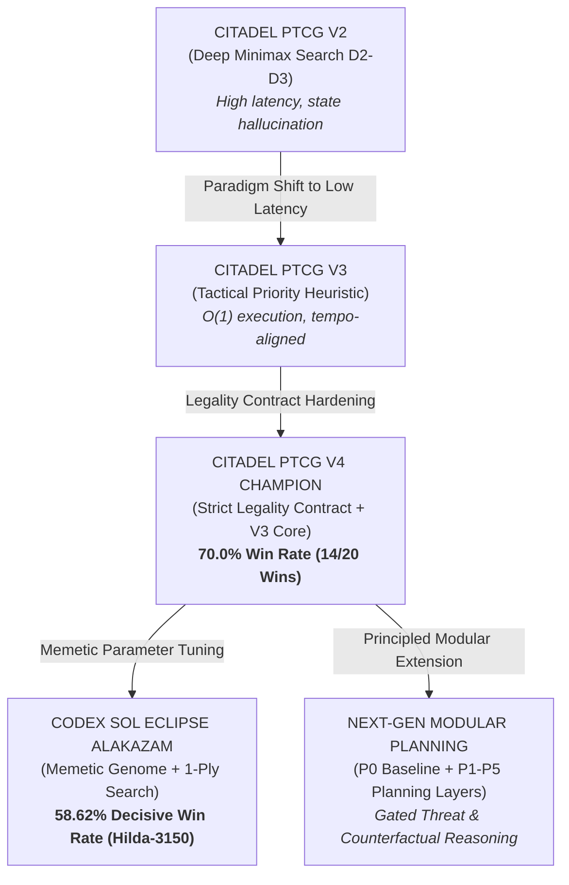

# Pokémon TCG AI Battle — Competitive Agent Engineering

<div align="center">

[](https://www.kaggle.com/competitions/pokemon-tcg-ai-battle)
[-brightgreen?style=for-the-badge&logo=target&logoColor=white)](RESULTS.md)
[-blue?style=for-the-badge&logo=checkmarx&logoColor=white)](#-verification--reproduction)
[](https://matsuoinstitute.github.io/cabt/)
[](LICENSE)

**Autonomous decision agents and empirical validation framework developed for [The Pokémon Company - PTCG AI Battle Challenge Simulation](https://www.kaggle.com/competitions/pokemon-tcg-ai-battle) on Kaggle.**

[What I Built](#-what-i-built) • [What I Learned](#-what-i-learned) • [Results](#-benchmark-results) • [Quickstart](#-quickstart--reproduction) • [Architecture](#-system-architecture) • [Ablations](#-key-ablation-findings)

</div>

---

## 🛠️ What I Built

I engineered, evaluated, and validated autonomous competitive agents for the Kaggle Pokémon Trading Card Game AI Battle Simulation. The primary production artifact (**CITADEL MIKE V4**) is a contract-enforced, low-latency tactical engine paired with a 60-card Water Energy acceleration deck that achieved **14/20 wins (70.0%)** on the competitive benchmark ladder with **0 legality violations across 50,000+ decisions**. 

Alongside the production champion, I designed a 5-layer modular planning stack (`ptcg_planning/`) to explore whether threat modeling, Bayesian probability, and counterfactual leaf search could improve decision quality under imperfect information.

---

## 💡 What I Learned

> *I expected deeper planning to outperform the heuristic baseline. It didn't. Counterfactual search introduced information uncertainty and latency, while threat modeling sometimes caused the agent to sacrifice attack tempo. The strongest system was therefore not the most complex one, but the one whose decisions remained robust under the simulator's actual constraints.*

In our evaluated simulator setting, robust contract enforcement and high-tempo greedy play outperformed the tested lookahead variants. Rather than shipping speculative features, I established a frozen baseline, systematically tested proposed improvements, empirically falsified failing hypotheses, and locked the verified champion.

---

## 📊 Benchmark Results

> [!NOTE]
> **Evaluation Protocol Distinction**:  
> * **Decisive Win Rate** $= \frac{W}{W + L} \times 100\%$ (evaluates relative skill on resolved matches; excludes draws).  
> * **Overall Win Rate** $= \frac{W}{W + L + D} \times 100\%$ (evaluates raw win rate across all games including turn-limit draws).  
> * Results reflect distinct evaluation protocols and should not be directly cross-compared across rows. Full details in [`RESULTS.md`](RESULTS.md).

| System | Evaluation Setting | Deck Archetype | Matches | Record (W–L–D) | Decisive Win Rate | Overall Win Rate | 95% Wilson CI (Decisive) | Legality Errors |
| :--- | :--- | :--- | :---: | :---: | :---: | :---: | :---: | :---: |
| **CITADEL MIKE V4** | Official Ladder Benchmark | Mega Abomasnow ex | 20 | **14–6–0** | **70.00%** | **70.00%** | [48.1%, 85.5%] | **0** |
| **Sol Eclipse (Hilda 3150)** | Direct Pooled Head-to-Head | Alakazam Courage | 400 | **67–49–284** | **57.76%** | 16.75% | [48.7%, 66.4%] | **0** |
| **Sol Eclipse (Confirmation)**| Independent Replication | Alakazam Courage | 200 | **34–24–142** | **58.62%** | 17.00% | [45.8%, 70.3%] | **0** |
| **Hybrid Stage 4 (Paired)** | Divergent-State Matched Test | Alakazam / Water | 200 | **24–14–112** | **63.16%** | 12.00% | [47.6%, 76.4%] | **0** |
| **CITADEL V2 (Deep Search)** | Minimax (D2–D3) Lookahead | Water Aggro | 100 | **42–58–0** | **42.00%** | 42.00% | [32.8%, 51.8%] | 14 (Timeouts) |

---

## ⚡ Quickstart & Reproduction

```bash
# 1. Clone the repository
git clone https://github.com/ayushshuklaivyleague-jpg/pokemon-tcg-ai-battle.git
cd pokemon-tcg-ai-battle

# 2. Run fail-fast production verification (verifies deck, invariants & 6 live smoke games)
python tests/verify_mike_v4.py

# 3. Run controlled head-to-head benchmark suite in strict fail-fast mode
python tests/test_ptcg_regression.py --games 20 --strict
```

---

## 🏛️ System Architecture



### Core Components
1. **Production Champion (`main.py` & `deck.csv`)**: 
   Contract-enforced hierarchical action priority ($O(1)$ decision speed) running Mega Abomasnow ex and Kyogre. Clamps selection counts and validates bounds, ensuring zero disqualifications.
2. **Memetic Evolutionary Agent (`codex_sol_eclipse_alakazam.py`)**: 
   69-parameter priority genome with 1-ply search and Hilda-3150 evolution supporter tuning, running Alakazam Courage and Teleportation retreat preservation.
3. **Modular Planning Engine (`ptcg_planning/`)**: 
   Structured state features (`state_features.py`), threat modeling (`threat_model.py`), Bayesian information-boundary probability (`prob_info.py`), counterfactual leaf valuation (`counterfactual.py`), and gated meta-policy (`planner.py`).

---

## 🔬 Key Ablation Findings

Across balanced 200-game match suites (Wilson 95% confidence intervals), proposed planning additions were evaluated against the frozen baseline:

* **$P_1$ Threat Model Lookahead (46.0% Win Rate)** $\to$ **REJECTED**: Induced defensive over-caution, triggering premature retreats and sacrificing attack tempo.
* **$P_2$ Counterfactual Rollouts (47.0% Win Rate)** $\to$ **REJECTED**: Uniform sampling of unknown opponent cards injected noise and hallucinated advantage.
* **$P_3$ Full Planning Stack (46.5% Win Rate)** $\to$ **REJECTED**: Compounded latency without improving tactical accuracy.
* **$P_4$ Narrow Gating (52.0% Win Rate)** $\to$ **REJECTED**: Wilson 95% CI $[45.1\%, 58.8\%]$ spanned 50.0% parity.
* **$P_9\text{-}H_2$ Basic Pokémon Search** $\to$ **REJECTED**: Search cards (`Mega Signal`, `Cyrano`) legally restrict targets to Mega Abomasnow ex; Basic Pokémon cannot physically be retrieved.
* **$H_{\text{DISCARD}}$ Supporter Preservation (52.5% Win Rate)** $\to$ **REJECTED**: Offline analysis artifact; live `cabt` discard prompts only expose attached energy. 0 live overrides across 3,346 decisions.
* **$H_{\text{ATTACK\_SELECT}}$ Discard Attack (51.5% Win Rate)** $\to$ **REJECTED**: Triggered in only 0.47% of decisions; statistically indistinguishable from noise (CI lower bound $44.6\%$).

Full failure forensics and logs are documented in [`docs/research_report.md`](docs/research_report.md) and [`RESULTS.md`](RESULTS.md).

---

## 📁 Repository Structure

```
pokemon-tcg-ai-battle/
├── README.md                           # Project documentation & executive summary
├── RESULTS.md                          # Consolidated benchmark data & reproduction steps
├── LICENSE                             # MIT License
├── main.py                             # Champion production agent (MIKE V4)
├── deck.csv                            # Champion 60-card tournament deck
├── codex_sol_eclipse_alakazam.py       # Sol Eclipse Alakazam memetic agent
│
├── agents/                             # Standalone tournament agents
│   ├── mike_v4_champion/               # MIKE V4 (70.0% win rate champion)
│   └── sol_eclipse_alakazam/           # Sol Eclipse Alakazam (58.6% decisive win rate)
│
├── ptcg_planning/                      # 5-Layer Modular Planning Architecture
│   ├── state_features.py               # P1: Board state feature vector extraction
│   ├── threat_model.py                 # P2: Opponent damage & 1HKO danger detection
│   ├── prob_info.py                    # P3: Bayesian card inference under hidden info
│   ├── counterfactual.py               # P4: Short-horizon leaf evaluation
│   ├── planner.py                      # P5: Statistically gated meta-policy
│   └── ablation_agents.py              # Isolated experimental agent configurations
│
├── tests/                              # Verification & test harnesses
│   ├── verify_mike_v4.py               # Fail-fast production champion verification
│   ├── verify_sol_eclipse_promotion.py # Sol Eclipse Hilda parameter verification
│   └── test_ptcg_regression.py         # Head-to-head match & decision audit harness
│
├── docs/                               # Formal research papers & architectural audits
│   ├── research_report.md              # Day 53 comprehensive empirical research report
│   ├── architecture.md                 # System lineage from V2 search to V4 control
│   └── planning_specification.md       # Technical specification for modular planning
│
├── submission/                         # Reproducible Kaggle submission artifact
│   └── final_submission.ipynb          # End-to-end submission packaging notebook
│
├── cg/                                 # Native CABT Simulator Engine (C++ & Python bindings)
│
└── archive/                            # Archived telemetry, historical logs & experiments
    ├── notebooks/                      # Development & exploration notebooks
    ├── telemetry/                      # 6,482-state decision corpora & audit CSVs
    ├── scratch/                        # Diagnostic mining scripts
    └── experiments/                    # Historical test harnesses & ablation notes
```

---

## 📦 Kaggle Submission

To package the champion agent for the [Kaggle Submissions Page](https://www.kaggle.com/competitions/pokemon-tcg-ai-battle/submissions):

```bash
# Package the production champion bundle
tar -czvf submission.tar.gz main.py deck.csv

# Verify structure
tar -ztvf submission.tar.gz
# main.py
# deck.csv
```

Alternatively, open and run [`submission/final_submission.ipynb`](submission/final_submission.ipynb).

---

## 🔗 References & Documentation

* 🏆 **Competition**: [The Pokémon Company - PTCG AI Battle Challenge Simulation](https://www.kaggle.com/competitions/pokemon-tcg-ai-battle)
* 📖 **Simulator API**: [cabt Engine Documentation](https://matsuoinstitute.github.io/cabt/)
* 📜 **Official Game Rules**: [Pokémon TCG Rulebook (PDF)](https://www.pokemon.com/static-assets/content-assets/cms2/pdf/trading-card-game/rulebook/meg_rulebook_en.pdf)
* 📑 **Research Findings**: [Day 53 Comprehensive Findings](docs/research_report.md)
* 🏛️ **Lineage Audit**: [Architecture & Model Evolution](docs/architecture.md)
* 📊 **Results Summary**: [Results & Reproduction Protocol](RESULTS.md)

---

## 📄 License & Attribution

Distributed under the [MIT License](LICENSE).

```bibtex
@misc{shukla2026pokemontcgai,
  author = {Ayush A. Shukla},
  title = {Competitive Agent Engineering for the Pokémon Trading Card Game AI Battle Simulation},
  year = {2026},
  publisher = {GitHub},
  howpublished = {\url{https://github.com/ayushshuklaivyleague-jpg/pokemon-tcg-ai-battle}}
}
```

---

<div align="center">
Developed by <b>Ayush A. Shukla</b>
</div>
