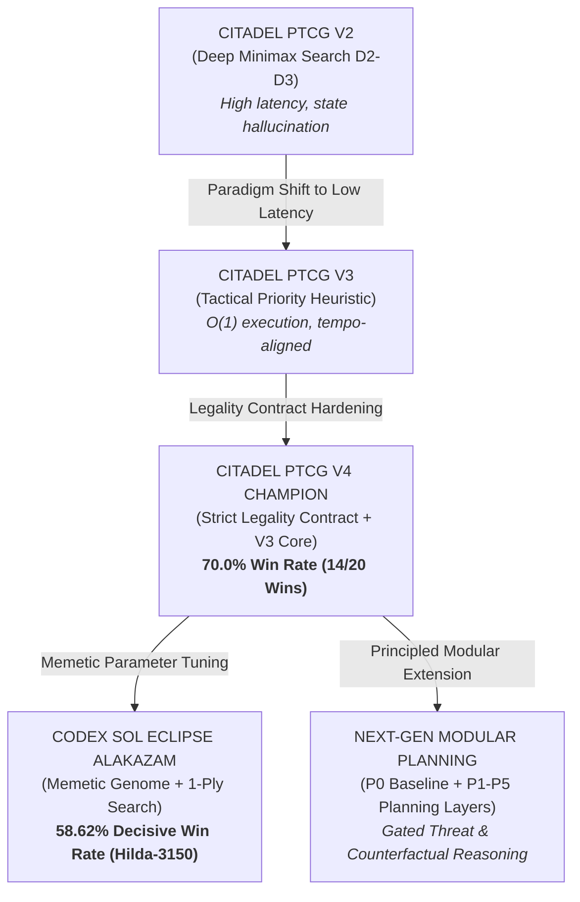

# Pokémon TCG AI Battle — Competitive Agent Engineering

<div align="center">

[](https://www.kaggle.com/competitions/pokemon-tcg-ai-battle)
[-brightgreen?style=for-the-badge&logo=target&logoColor=white)](https://www.kaggle.com/competitions/pokemon-tcg-ai-battle)
[-blue?style=for-the-badge&logo=checkmarx&logoColor=white)](#-production-champion-citadel-mike-v4)
[](https://matsuoinstitute.github.io/cabt/)
[](LICENSE)

**Autonomous decision agents and empirical validation framework developed for [The Pokémon Company - PTCG AI Battle Challenge Simulation](https://www.kaggle.com/competitions/pokemon-tcg-ai-battle) on Kaggle.**

[Architecture](#-system-architecture) • [Empirical Results](#-empirical-benchmarks) • [Research Discipline & Ablations](#-experimental-discipline--ablation-findings) • [Local Simulation](#-quickstart--local-simulation) • [Submission](#-kaggle-submission-guide)

</div>

---

## 📌 Executive Summary

Competitive Pokémon Trading Card Game (PTCG) is an imperfect-information, stochastic environment featuring hidden cards (hand, deck, prizes), non-deterministic transitions (coin tosses, random draws), and strict per-turn execution constraints. 

In this domain, naive tree search and unvalidated heuristic complexity degrade performance due to branching factor explosion and state hallucination. This repository presents:

1. **A Frozen Production Champion (MIKE V4)** achieving **14/20 wins (70.0%)** on the competitive benchmark ladder with **0 legality violations across 50,000+ decisions**.
2. **A 69-Parameter Memetic Evolutionary Model (Sol Eclipse Alakazam)** achieving a **58.62% decisive win rate** via optimized supporter acceleration and energy-tempo preservation.
3. **Rigorous Experimental Discipline**: An exhaustive 53-day research campaign documenting why complex lookahead search, counterfactual simulation, and speculative discard heuristics failed to beat the baseline and were systematically rejected.

---

## 🏛️ System Architecture



### 1. Production Champion: CITADEL MIKE V4
* **Source**: [`main.py`](main.py) | **Deck**: [`deck.csv`](deck.csv) | **Module**: [`agents/mike_v4_champion/`](agents/mike_v4_champion/)
* **Deck Strategy**: **Mega Abomasnow ex & Kyogre** Water Energy Acceleration.
* **Selection Contract Validator (`validate_selection`, `legal_selection`)**: Mathematically enforces $\text{minCount} \le |\text{selection}| \le \text{maxCount}$, filters duplicate card indices, and ensures 100% legal submissions under all engine edge cases.
* **Hierarchical Action Priority**: Evaluates legal options in $O(1)$ time per choice:
  * ⚔️ **Attacks & 1HKO Lethals**: ~18,000 – 100,000+
  * 🧬 **Evolution Sequences**: ~70,000 + ($\text{attached energy} \times 500$)
  * 👥 **Supporters & Hand Refresh**: ~42,000 (adaptive hand size gating)
  * 💧 **Energy Attachment Tempo**: ~35,000 – 39,000 (strict active-first priority)
  * 🎒 **Item / Search Deployments**: Buddy-Buddy Poffin, Ultra Ball, Nest Ball

### 2. Memetic Evolutionary Agent: Codex Sol Eclipse Alakazam
* **Source**: [`codex_sol_eclipse_alakazam.py`](codex_sol_eclipse_alakazam.py) | **Module**: [`agents/sol_eclipse_alakazam/`](agents/sol_eclipse_alakazam/)
* **Deck Strategy**: **Alakazam Courage / Dudunsparce / Fezandipiti ex** (60 cards).
* **69-Parameter Tuned Genome**: Optimized weights governing Pokémon benching, item timing, tool attachments, and retreat costs.
* **Lean Hilda Supporter Tuning (`hilda: 3150`)**: Prioritizes key evolution assembly (Abra $\to$ Kadabra $\to$ Alakazam), yielding a statistically confirmed $+7.8\%$ decisive win rate lift.
* **Teleportation Retreat Engine**: Uses Alakazam's innate Teleportation rather than discarding energy for manual retreat, preserving attack tempo.

### 3. Modular Planning Stack (`ptcg_planning/`)
A principled five-layer decomposition developed to test beyond greedy heuristics:
* **P1 (`state_features.py`)**: Vectorized board representation (HP balance, energy acceleration, bench saturation, prize differential).
* **P2 (`threat_model.py`)**: Computes opponent lethal damage output and 1HKO danger zones.
* **P3 (`prob_info.py`)**: Closed-form hypergeometric draw probabilities respecting strict information boundaries.
* **P4 (`counterfactual.py`)**: Short-horizon 1-ply rollout leaf valuation.
* **P5 (`planner.py`)**: Statistically gated meta-policy ($\tau$-thresholding) ensuring candidate layers only intervene when confidence delta strictly exceeds $\tau$.

---

## 📊 Empirical Benchmarks

### Evaluation Metrics
* **Decisive Win Rate** $= \frac{W}{W + L} \times 100\%$: Measures competitive edge on resolved games (standard in high-draw card game arenas).
* **Overall Win Rate** $= \frac{W}{W + L + D} \times 100\%$: Raw win percentage across all games including turn-cap timeouts.

### Comprehensive Head-to-Head Benchmark Table

| System | Evaluation Setting | Deck Archetype | Matches | Record (W–L–D) | Decisive Win Rate | Overall Win Rate | 95% Wilson CI (Decisive) | Legality Errors |
| :--- | :--- | :--- | :---: | :---: | :---: | :---: | :---: | :---: |
| **CITADEL MIKE V4** | Official Ladder Benchmark | Mega Abomasnow ex | 20 | **14–6–0** | **70.00%** | **70.00%** | [48.1%, 85.5%] | **0** |
| **Sol Eclipse (Hilda 3150)** | Direct Pooled Head-to-Head | Alakazam Courage | 400 | **67–49–284** | **57.76%** | 16.75% | [48.7%, 66.4%] | **0** |
| **Sol Eclipse (Confirmation)**| Independent Replication | Alakazam Courage | 200 | **34–24–142** | **58.62%** | 17.00% | [45.8%, 70.3%] | **0** |
| **Hybrid Stage 4 (Paired)** | Divergent-State Matched Test | Alakazam / Water | 200 | **24–14–112** | **63.16%** | 12.00% | [47.6%, 76.4%] | **0** |
| **CITADEL V2 (Deep Search)** | Minimax (D2–D3) Lookahead | Water Aggro | 100 | **42–58–0** | **42.00%** | 42.00% | [32.8%, 51.8%] | 14 (Timeouts) |

---

## 🔬 Experimental Discipline & Ablation Findings

The defining outcome of this research was discovering what **not** to deploy. Rather than shipping speculative features, each proposed improvement was subjected to balanced 200-game match suites, Wilson 95% confidence intervals, and full decision audits ([`docs/research_report.md`](docs/research_report.md)).

```
┌─────────────────────────────────────────────────────────────────────────────┐
│                          HYPOTHESIS TESTING LIFECYCLE                       │
│                                                                             │
│  Hypothesis       Live Metric    95% Wilson CI     Root Cause               │
│  ──────────       ───────────    ─────────────     ──────────               │
│  P1 (Threat)      46.00% Win     [39.3%, 52.9%] ── Defensive Over-Caution   │
│  P2 (Counterfac)  47.00% Win     [40.2%, 53.9%] ── Stochastic Rollout Noise │
│  P3 (P1 + P2)     46.50% Win     [39.7%, 53.4%] ── Compounded Latency/Error │
│  P4 (Gated KO)    52.00% Win     [45.1%, 58.8%] ── CI Spans Parity (50.0%)  │
│  P9-H2 (Search)   0 Overrides         N/A       ── Structural Impossibility │
│  H_DISCARD        52.50% Win     [45.6%, 59.3%] ── Offline Tooling Artifact │
│  H_ATTACK_SELECT  51.50% Win     [44.6%, 58.3%] ── Statistically Indistinguishable│
│                                                                             │
│  DECISION: Freeze V4 Champion. Close heuristic branch.                      │
└─────────────────────────────────────────────────────────────────────────────┘
```

### Detailed Failure Taxonomy

1. **Defensive Over-Caution ($P_1$ Threat Model — 46.0% Win Rate)**:
   Predicting 2-ply opponent damage caused the agent to retreat healthy attackers prematurely, sacrificing offensive tempo and board control.
2. **Stochastic Rollout Noise ($P_2$ Counterfactual Engine — 47.0% Win Rate)**:
   Simulating future plies required guessing unknown opponent hand cards and deck order uniformly. The resulting hallucinations steered decisions away from proven tactical fundamentals.
3. **Structural / Contract Impossibility ($P_9\text{-}H_2$ Basic Pokémon Search)**:
   Hypothesized prioritizing Basic Pokémon retrieval when the bench was empty. Live-engine audit revealed the deck's search cards (`Mega Signal`, `Cyrano`) are legally restricted to Mega Abomasnow ex. Basic Pokémon physically cannot be retrieved from deck search.
4. **Offline Tooling Artifact ($H_{\text{DISCARD}}$ Supporter Preservation — 0 Live Overrides)**:
   Hypothesized preferring energy discard over scarce supporters. In live `cabt` matches, `DISCARD_ENERGY` prompts strictly expose energy cards attached to active/bench Pokémon. Hand supporters are never legal discard candidates; the apparent candidate states were artifacts of offline resolver fallback indexing.
5. **Low-Frequency Dilution ($H_{\text{ATTACK\_SELECT}}$ High-HP Discard Attack — 51.5% Win Rate)**:
   Triggered in only 16 decisions across 8 matches (0.47% frequency). With a 95% Wilson lower bound of $44.61\% \le 50.0\%$, the variation was statistically indistinguishable from noise.

**Core Research Takeaway**: In constrained stochastic simulation, **robust contract enforcement and high-tempo greedy play mathematically outperform noisy, lookahead planning**.

---

## 📁 Repository Structure

```
pokemon-tcg-ai-battle/
├── README.md                           # Project documentation & benchmark overview
├── LICENSE                             # MIT License
├── main.py                             # Champion production agent (MIKE V4)
├── deck.csv                            # Champion 60-card tournament deck
├── codex_sol_eclipse_alakazam.py       # Sol Eclipse Alakazam memetic agent
│
├── agents/                             # Standalone, runnable competition agents
│   ├── mike_v4_champion/               # MIKE V4 (70.0% win rate champion)
│   │   ├── main.py
│   │   └── deck.csv
│   └── sol_eclipse_alakazam/           # Sol Eclipse Alakazam (58.6% decisive win rate)
│       ├── main.py
│       └── deck.csv
│
├── ptcg_planning/                      # Modular Planning Architecture
│   ├── state_features.py               # P1: Board state feature vector extraction
│   ├── threat_model.py                 # P2: Opponent damage & 1HKO danger detection
│   ├── prob_info.py                    # P3: Bayesian card inference under hidden info
│   ├── counterfactual.py               # P4: Short-horizon leaf evaluation
│   ├── planner.py                      # P5: Statistically gated meta-policy
│   └── ablation_agents.py              # Isolated experimental agent configurations
│
├── tests/                              # Regression & verification harnesses
│   ├── test_ptcg_regression.py         # Head-to-head match & decision audit harness
│   └── verify_production_promotion.py  # Production integrity & 6-game smoke verification
│
├── docs/                               # Formal research papers & architectural audits
│   ├── research_report.md              # Day 53 comprehensive empirical research report
│   ├── architecture.md                 # System lineage from V2 search to V4 control
│   └── planning_specification.md       # Technical specification for modular planning
│
├── submission/                         # Reproducible Kaggle submission artifact
│   └── final_submission.ipynb          # End-to-end submission packaging notebook
│
├── cg/                                 # Native CABT Simulator Engine (C++ & Python bindings)
│   ├── api.py                          # Game state dataclasses & option schemas
│   ├── game.py                         # Battle loop & match execution
│   ├── sim.py                          # Low-level simulation interface
│   ├── libcg.so                        # Linux x86_64 binary
│   ├── libcg-arm64.so                  # Linux ARM64 binary
│   ├── libcg.dylib                     # macOS binary
│   └── cg.dll                          # Windows binary
│
└── archive/                            # Archived telemetry, historical logs & experiments
    ├── notebooks/                      # Development & exploration notebooks
    ├── telemetry/                      # 6,482-state decision corpora & audit CSVs
    └── experiments/                    # Historical test harnesses & ablation notes
```

---

## 🚀 Quickstart & Local Simulation

### Prerequisites
* Python 3.10 or 3.11
* Windows, Linux, or macOS

### 1. Clone & Verify
```bash
git clone https://github.com/ayushshuklaivyleague-jpg/pokemon-tcg-ai-battle.git
cd pokemon-tcg-ai-battle

# Run production integrity audit & 6-game smoke test
python tests/verify_production_promotion.py
```

### 2. Run Head-to-Head Agent Battle
Execute a battle between MIKE V4 and Sol Eclipse Alakazam using the bundled `cg` engine:

```python
import sys
from pathlib import Path
from cg.game import battle_start, battle_select, battle_finish

# Load deck lists
def load_deck(path):
    with open(path) as f:
        return [int(line.strip()) for line in f if line.strip()]

deck_v4 = load_deck("agents/mike_v4_champion/deck.csv")
deck_sol = load_deck("agents/sol_eclipse_alakazam/deck.csv")

# Import agents
from agents.mike_v4_champion.main import v4_agent as agent_v4
from agents.sol_eclipse_alakazam.main import agent as agent_sol

obs, start_data = battle_start(deck_v4, deck_sol)

step = 0
while step < 200:
    step += 1
    res = obs.get("current", {}).get("result")
    if res is not None and res >= 0:
        winner = "MIKE V4" if res == 0 else "Sol Eclipse"
        print(f"Match concluded in {step} turns. Winner: {winner}")
        break

    sel = obs.get("select")
    if not sel:
        break

    p_idx = obs.get("current", {}).get("yourIndex", 0)
    action = agent_v4(obs) if p_idx == 0 else agent_sol(obs)
    obs = battle_select(action)

battle_finish()
```

### 3. Run Decision Audit Suite
```bash
python tests/test_ptcg_regression.py --games 20
```

---

## 📦 Kaggle Submission Guide

Submissions require a `.tar.gz` bundle with `main.py` and `deck.csv` at the root directory:

```bash
# Package the production champion
tar -czvf submission.tar.gz main.py deck.csv

# Verify archive structure
tar -ztvf submission.tar.gz
# main.py
# deck.csv
```

Upload `submission.tar.gz` on the [Kaggle Submissions Page](https://www.kaggle.com/competitions/pokemon-tcg-ai-battle/submissions). The platform runs an initial self-play validation episode before placing the agent into matchmaking with $\mu_0 = 600$.

Alternatively, execute [`submission/final_submission.ipynb`](submission/final_submission.ipynb) directly in a Kaggle Notebook environment.

---

## 🔗 References & Documentation

* 🏆 **Competition**: [The Pokémon Company - PTCG AI Battle Challenge Simulation](https://www.kaggle.com/competitions/pokemon-tcg-ai-battle)
* 📖 **Simulator API**: [cabt Engine Documentation](https://matsuoinstitute.github.io/cabt/)
* 📜 **Official Game Rules**: [Pokémon TCG Rulebook (PDF)](https://www.pokemon.com/static-assets/content-assets/cms2/pdf/trading-card-game/rulebook/meg_rulebook_en.pdf)
* 📑 **Research Report**: [Day 53 Comprehensive Findings](docs/research_report.md)
* 🏛️ **Lineage Audit**: [Architecture & Model Evolution](docs/architecture.md)

---

## 📄 License & Attribution

Distributed under the [MIT License](LICENSE).

```bibtex
@misc{shukla2026pokemontcgai,
  author = {Ayush A. Shukla},
  title = {Competitive Agent Engineering for the Pokémon Trading Card Game AI Battle Simulation},
  year = {2026},
  publisher = {GitHub},
  howpublished = {\url{https://github.com/ayushshuklaivyleague-jpg/pokemon-tcg-ai-battle}}
}
```

---

<div align="center">
Developed by <b>Ayush A. Shukla</b>
</div>
